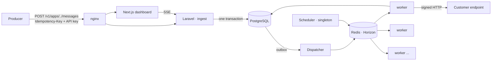
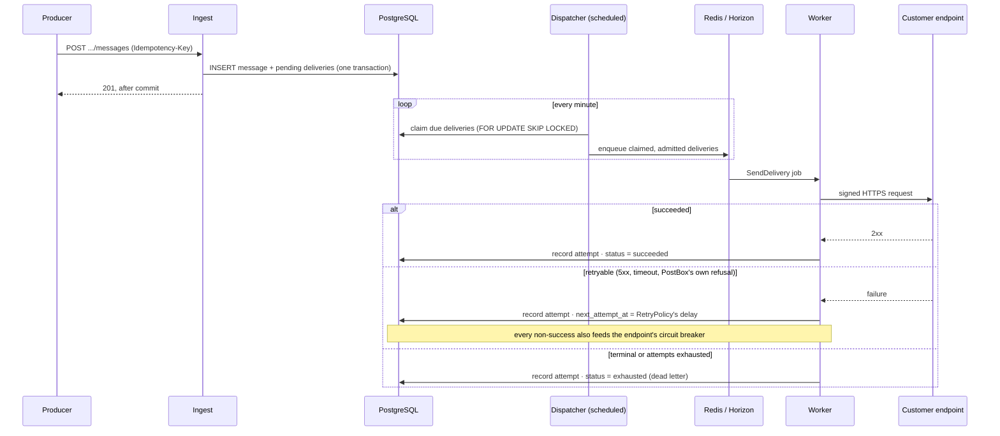

# PostBox

A self-hosted, multi-tenant webhook delivery gateway. Tenants register endpoints, publish events
through an API, and PostBox guarantees delivery with HMAC signing, idempotency, retries with
backoff, and per-endpoint circuit breaking.

> **Status: feature-complete.** All 17 roadmap steps delivered — tenancy, ingest, the delivery
> engine, resilience, horizontal scaling, the OpenAPI contract, the operator dashboard, the live
> stream, client SDKs, and this step's own observability and documentation. See `docs/adr/` for
> the decisions behind it.

## Quickstart

Requires Docker and Docker Compose. Nothing else — PHP, Composer and Node run inside containers.

```powershell
.\task.ps1 up      # Windows
```

```bash
make up            # Linux / macOS
```

Then:

| URL | What |
|---|---|
| http://localhost:8080 | Dashboard (Next.js, through nginx) |
| http://localhost:8080/api/health | Deep health check — database, Redis, queue, migrations |
| http://localhost:8025 | Mailpit (development profile only) |

`task.ps1 down` stops the stack; `task.ps1 fresh` rebuilds it from empty volumes.

## Architecture

One Laravel application, two ingress surfaces and one asynchronous delivery path, plus a Next.js
operator dashboard. No microservice split — the separation that matters is between the **ingest
path** (must be fast and never lose data) and the **delivery path** (must be reliable and
horizontally scalable).



Tenant isolation is three independent layers — an application-level global scope, automatic
tenant assignment on write, and PostgreSQL Row Level Security declared `FORCE`, so even the
schema-owning role is subject to it (`docs/adr/0001`). The repository pattern is deliberately
absent; Eloquent is the data layer (`docs/adr/0006`). Public identifiers are prefixed ULIDs —
`app_`, `ep_`, `msg_`, `dlv_`, `att_`, `rpl_` — sortable by creation time, carrying no tenant
information, with internal integer keys never exposed (`docs/adr/0005`).

### Delivery flow

At-least-once, never zero: the message and its pending deliveries are written in one transaction
(a transactional outbox), and only the scheduled dispatcher — never the request path — ever
enqueues anything (`docs/adr/0002`).



The retry schedule — attempt count, base delay, growth factor, injected jitter, ceiling — lives in
one policy object, reproducible in a test with jitter pinned (`docs/adr/0003`). A per-endpoint
circuit breaker, three states with one explicit transition table, stops a consistently failing
endpoint from consuming worker capacity and re-enables only through a single-probe half-open path
(`docs/adr/0004`).

## Observability

Every request carries a correlation id — a caller's own `X-Request-Id` if it looks like one, a
generated ULID otherwise — echoed back and attached to every log line the request produces.
`SendDelivery` carries its own correlation once it leaves the request that enqueued it: the
message, delivery and endpoint's public ids. Production logs one JSON object per line to stderr.

The dashboard's **Operations** screen (`GET /v1/operations`) reads the three delivery queues'
current depth, wait and throughput straight from Horizon's own repositories, and this tenant's
circuit breakers by state — an operator's answer to "is the delivery path healthy right now,"
distinct from the message ledger's own "what happened to this delivery."

## SDKs

`sdk/php` and `sdk/ts` publish events, verify webhook signatures and raise typed errors, method for
method, both retrying a transport failure, a 5xx or a 429 with one reused `Idempotency-Key` — never
a 401/402/404/409/422. Both are held to `contract/signature-vectors.json`, one shared file whose
every expected value is computed independently with `openssl`, so backend and both SDKs are proven
to agree byte for byte rather than merely assumed to. See `sdk/php/README.md` and
`sdk/ts/README.md`.

## Benchmark

A sink ceiling reported next to every PostBox figure, and no claim without a committed k6 script
behind it (`load/README.md` has the full protocol and the scripts). The raw k6 output and each
run's environment record are deliberately untracked (`load/README.md`); the numbers below are the
committed, curated summary of three runs — 2026-09-14 (Phase 1), 2026-09-17 (Phases 4–5) and
2026-09-23 (Phases 0, 2 and 3, re-measured for Step 15 Phase C, below).

| Phase | Workers | Throughput | p95 | Sink ceiling | Date |
|---|---|---|---|---|---|
| 1 — Sink ceiling | — | ≥ 6,400 req/s | 1.78ms | — | 2026-09-14 |
| 2 — Ingest (workers stopped) | 0 | 39.6 req/s | 554ms | ≥ 6,400 req/s | 2026-09-23 |
| 3 — End-to-end delivery | 1 | 14.9 req/s ingest · 100% delivered | 251ms ingest · 58s ingest-to-delivered | ≥ 6,400 req/s | 2026-09-23 |
| 5 — Degraded receiver | 1 container | 100% delivered (clean) · 0 dead-lettered (degraded) | — | ≥ 6,400 req/s | 2026-09-17 |

**Phase 2 and 3 were re-measured on 2026-09-23** (Step 15 Phase C, D136): `pm.max_children` is now
an explicit `16`, not the stock `5` the original 2026-09-14 figures (19.9 req/s, 44s) were bound
by — an SSE connection (Step 15) pins one FPM child for its whole life, so the stock pool was no
longer only a benchmark footnote. Phase 2's new ceiling is `pm.max_children = 16` itself, the same
kind of finding as before, just a larger number; 50 req/s is already past it (p95 1.09s). Phase
3's 58s figure is the same run shape as 2026-09-14's own 44s one (449 messages, one dispatcher
pass) — the gap between them is scheduler-boundary alignment, not a regression, and a *second*
Phase 3 run at a realistic higher rate (899 messages, exceeding `postbox.outbox.batch_size` (500)
inside one dispatch tick) found a new, named bottleneck, recorded in that run's own local summary.
`DispatchOutboxCommand`'s once-a-minute schedule, not worker throughput,
is still what every ingest-to-delivered figure in this table is dominated by — every attempt that
ran still succeeded in about 1ms.

**Phase 5's clean endpoint was not starved by its degraded sibling — structurally, not by luck**:
admission is asked once per endpoint before a delivery ever reaches a worker, and a deferred
delivery never touches the retry queue, which stayed at 0 throughout the run.

### Scaling curve (Phase 4)

Not a repeat of Phase 3: Phase 3's own ceiling is upstream of worker count entirely (the FPM pool,
the outbox dispatcher's once-a-minute schedule), so Phase 4 instead drains a fixed backlog at 1, 3
and 5 worker **containers** (`HORIZON_DELIVERIES_PROCESSES` at its default of 10 throughout).

| Containers | Processes | Throughput | Sink ceiling | Date |
|---|---|---|---|---|
| 1 | 10 | 400.0 deliveries/s | ≥ 6,400 req/s | 2026-09-17 |
| 3 | 30 | 500.0 deliveries/s | ≥ 6,400 req/s | 2026-09-17 |
| 5 | 50 | 1,000.0 deliveries/s | ≥ 6,400 req/s | 2026-09-17 |

**The curve is not linear, and not the way diminishing returns would predict**: 1→3 containers
gains 25%, 3→5 then gains 100%. Per-attempt latency rises with concurrency (1ms → 3ms → 4ms,
millisecond precision), consistent with shared-resource contention (Postgres row locks, connection
pool) rather than the sink or the network; aggregate throughput still climbs, so the system is not
saturated at 5 containers. The exact multipliers carry real measurement noise —
`deliveries.last_attempted_at` is whole-second precision, and this backlog drains in single-digit
seconds — named rather than hidden, in that run's own local summary.

## No server exists

PostBox is not deployed anywhere. Production readiness is verified locally: the production
profile builds, starts and passes the same deep health check (`task.ps1 prod-up` /
`make prod-up`). This README will not imply a deployment that does not exist.

## Documentation

| Document | What |
|---|---|
| `CLAUDE.md` | Operating contract and critical business rules |
| `docs/adr/` | Public Architecture Decision Records |
| `sdk/php/README.md`, `sdk/ts/README.md` | Client SDKs |
| `load/README.md` | Benchmark protocol, scripts and results |
| `sink/README.md` | The load harness's own target |
